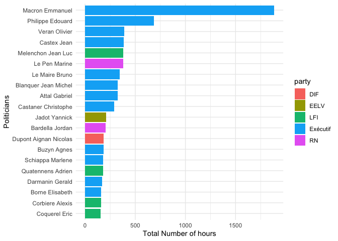

<!-- README.md is generated from README.Rmd. Please edit that file -->

# csatimer

`csatimer` provides data on how much airtime French politician receive
in the media.

The dataset contained in the package are also
[available](https://github.com/benjaminguinaudeau/csatimer/tree/master/inst/csv)
in the csv-format.

## Installation

``` r
# install.packages("devtools")
devtools::install_github("benjaminguinaudeau/csatimer")
```

## Data

*Last Update: January, 29 2022*

Two types of datasets are provided:

-   speaking time of politicians during routine period (no electoral
    campaigns)
-   speaking time of candidates during political campaigns

### Routine period (no electoral campaigns)

Every month, the [CSA](https://www.csa.fr/csapluralisme/tableau)
collects how long each political personality speaks on each of the major
radio and TV stations.

This dataset can be accessed using `read_csa_routine` and is continuous
between September 2017 and January 2022.

``` r
read_csa_routine() %>%
  glimpse
#> Rows: 109,068
#> Columns: 7
#> $ month     <date> 2017-09-01, 2017-09-01, 2017-09-01, 2017-09-01, 2017-09-01,…
#> $ station   <chr> "TF1", "France 2", "France 2", "France 2", "France 2", "Fran…
#> $ prog_type <chr> "JT", "JT", "JT", "MAG", "MAG", "PROG", "JT", "MAG", "JT", "…
#> $ name      <chr> "Macron Emmanuel", "Macron Emmanuel", "Macron Emmanuel", "Ma…
#> $ label     <chr> "Président De La République En Débat Politique", "Président …
#> $ party     <fct> "Exécutif", "Exécutif", "Exécutif", "Exécutif", "Exécutif", …
#> $ time      <dbl> 8.416667, 7.933333, 4.050000, 6.300000, 2.266667, 3.500000, …
```

It contains the following columns:

-   month <date> `"2017-01-01"`
-   station <chr> `"TF1", "France 2", "France Inter", ...`
-   prog\_type <chr> `"JT", "MAG", "PROG"`
-   name <chr>
    `"Emmanuel Macron", "Marine Le Pen", "François Hollande", ...`
-   label <chr>
    `"Président", "Parti Socialiste", "Ministre", "Les Républicains", ...`
-   party <chr> `"Exécutif" , "Ps", "LR", ...`
-   time <dbl>

Speaking times are measured in minutes. For instance, in September 2017,
Emanuel Macron spoke 8.4 minutes on TF1.

`prog_type` refers to different types of TV/Radio shows:

-   `JT`: newscast
-   `MAG`: political shows
-   `PROG`: non-political shows

### Electoral campaigns

During electoral campaigns - presidential, legislative and local - , the
CSA publishes airtime of campaigning candidates
[data](https://www.csa.fr/Proteger/Garantie-des-droits-et-libertes/Proteger-le-pluralisme-politique/Pendant-une-election)
*every two weeks*.

For each candidate, three different measures are computed:

-   `time_candidat`: speaking time of the candidate themselves
-   `time_support`: speaking time of personalities supporting the
    candidate
-   `time_mention`: speaking time of journalists mentioning the
    candidate

This dataset can be accessed using `read_csa_election("pres_2022")`.

Following elections are available:

-   Presidential elections 2022: `read_csa_election("pres_2022")`
-   Presidential elections 2017: `read_csa_election("pres_2017")`

``` r
read_csa_election("pres_2022")  %>%
  dplyr::glimpse()
#> Rows: 265
#> Columns: 9
#> $ type          <chr> "presidential", "presidential", "presidential", "preside…
#> $ constituency  <chr> "national", "national", "national", "national", "nationa…
#> $ date_start    <date> 2022-01-01, 2022-01-01, 2022-01-01, 2022-01-01, 2022-01…
#> $ date_end      <date> 2022-01-16, 2022-01-16, 2022-01-16, 2022-01-16, 2022-01…
#> $ station       <chr> "BFM", "BFM", "BFM", "BFM TV", "BFM TV", "BFM TV", "BFM …
#> $ candidat      <chr> "Macron Emmanuel", "Pecresse Valerie", "Zemmour Eric", "…
#> $ time_candidat <dbl> 0.0000000, 0.1333333, 0.6000000, 9.7166667, 50.9166667, …
#> $ time_support  <dbl> 3.9833333, 0.0000000, 0.0000000, 0.0000000, 31.0500000, …
#> $ time_mention  <dbl> 0.0000000, 0.0000000, 1.3166667, 0.0000000, 3.0666667, 1…
```

### Updating data

Data will be updated as the CSA publishes new routine and campaign data.

To update the data local version, use `update_csatimer()`

``` r
# Updating data
update_csatimer()
#> ℹ Updating 2017
#> ℹ Updating 2018
#> ℹ Updating 2019
#> ℹ Updating 2020
#> ℹ Updating 2021
#> ℹ Updating pres_2017
#> ℹ Updating pres_2022
```

## Example

Here are some graphic examples using `csatimer::read_csa_routine()`

### Example 1

``` r
read_csa_routine() %>%
  group_by(month) %>%
  summarise(n_hours = sum(time, na.rm = T)/60) %>%
  ggplot(aes(x = month, n_hours)) +
  geom_line() +
  theme_minimal() +
  labs(x = "", y = "Monthly number of hours of political attention", title = "How much do politicians speak in the media?")
```


### Example 2

``` r
read_csa_routine() %>%
  add_station_dummies %>%
  mutate(private = ifelse(is_private, "Private", "Public")) %>%
  group_by(private, station, month) %>%
  summarise(n_hours = sum(time, na.rm = T)/60) %>%
  ungroup %>%
  mutate(station = fct_reorder(station, n_hours)) %>%
  ggplot(aes(x = station, n_hours, fill = private)) +
  geom_boxplot(outlier.alpha = 0) +
  coord_flip() +
  labs(x = "Media outlet", y = "\nMonthly number of hours of political attention", fill = "") +
  theme_minimal() 
#> `summarise()` has grouped output by 'private', 'station'. You can override using the `.groups` argument.
```


### Example 3

``` r
read_csa_routine() %>% 
  group_by(party, name) %>%
  summarise(n_hours = sum(time, na.rm = T)/60) %>%
  ungroup %>%
  slice_max(n_hours, n = 20) %>%
  mutate(name = fct_reorder(name, n_hours)) %>%
  ggplot(aes(x = name, y = n_hours, fill = party)) +
  geom_col() +
  coord_flip() +
  theme_minimal() +
  labs(x = "Politicians", y = "Total Number of hours")
#> `summarise()` has grouped output by 'party'. You can override using the `.groups` argument.
```



### Example 4

``` r
read_csa_routine() %>% 
  filter(month > lubridate::dmy("07-01-2021")) %>%
  filter(station %in% c("TF1", "France 2", "France 3", "C8")) %>%
  group_by(station, party, name) %>%
  summarise(n_hours = sum(time, na.rm = T)/60) %>%
  ungroup %>%
  group_by(station) %>%
  slice_max(n_hours, n = 20) %>%
  ungroup %>%
  mutate(name = fct_reorder(name, n_hours)) %>%
  ggplot(aes(x = name, y = n_hours, fill = party)) +
  geom_col() +
  coord_flip() +
  theme_minimal() +
  facet_wrap(~station, scales = "free") +
  labs(x = "Politicians", y = "Total Number of hours") +
  ggtitle("Which politicians obtained the highest attention on four channel since July 2022?")
#> `summarise()` has grouped output by 'station', 'party'. You can override using the `.groups` argument.
```


